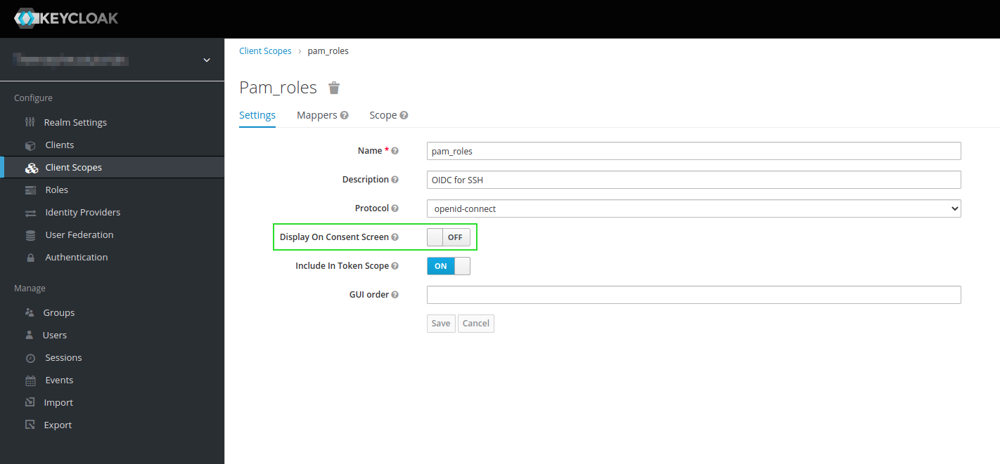
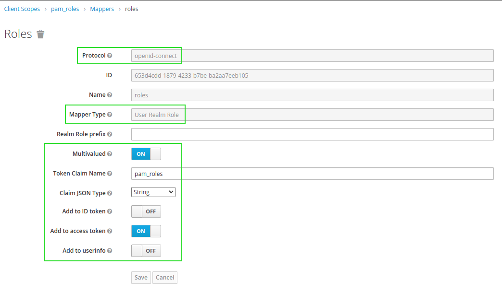
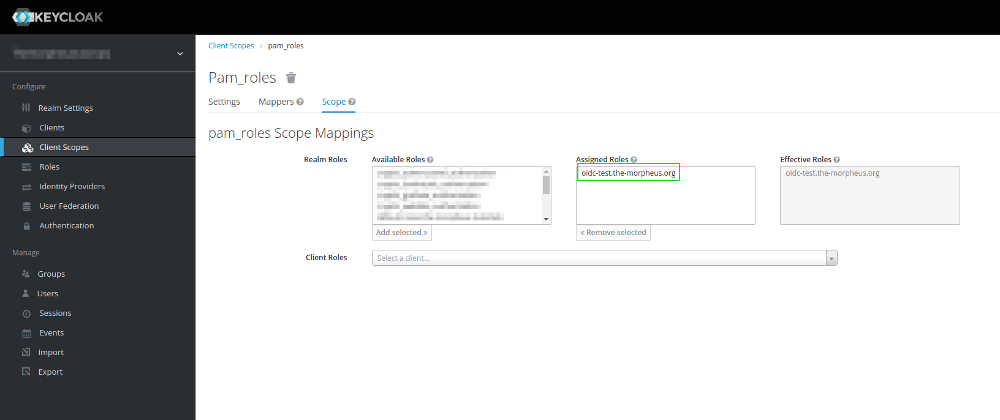
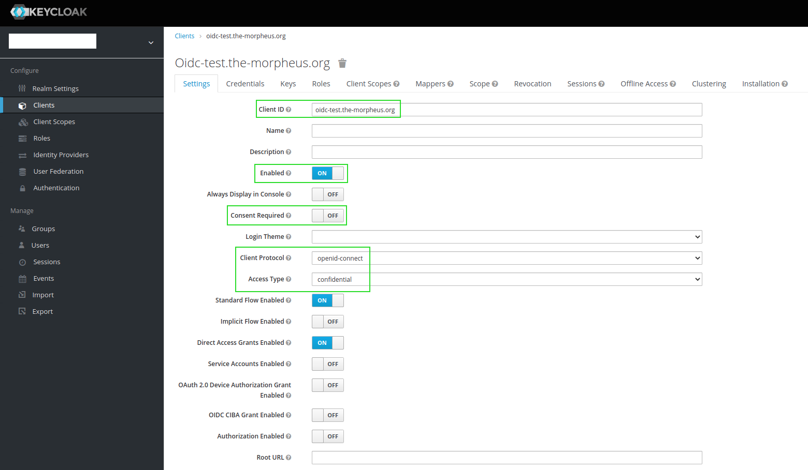
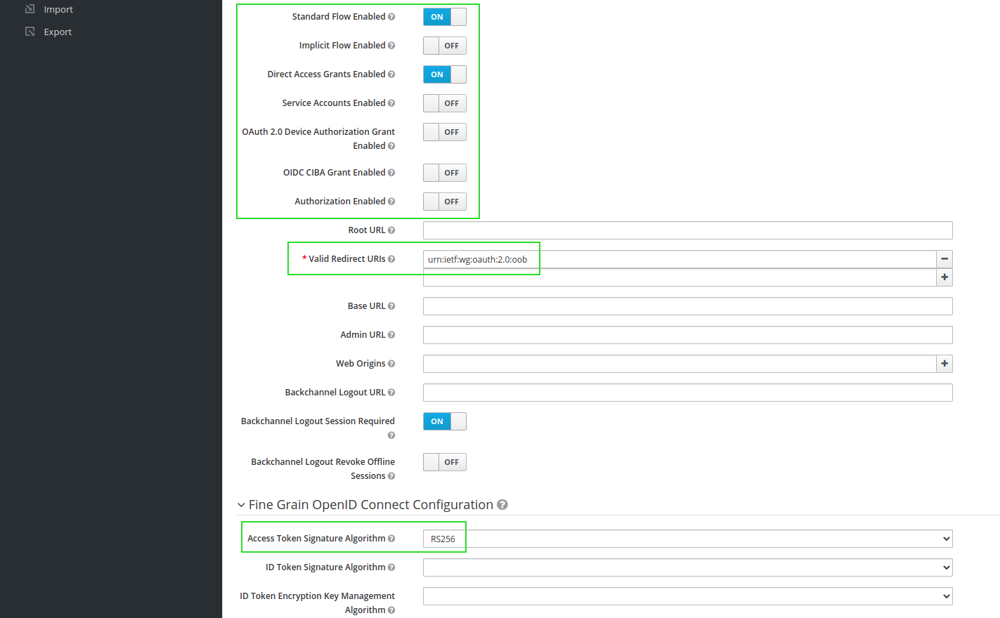
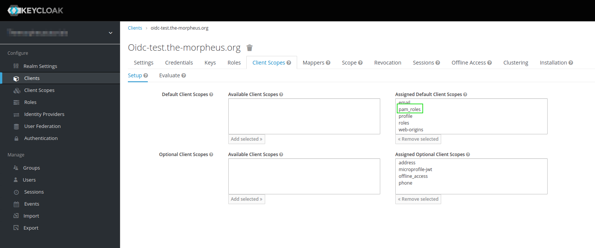
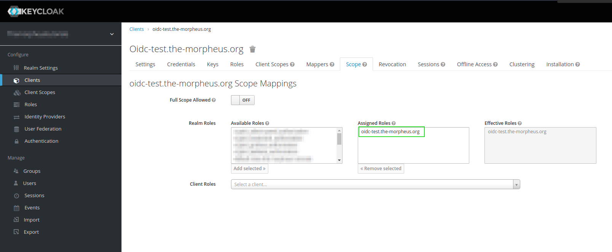

# Docker Keycloak SSH

SSH Daemon connected with Keycloak.

Edit the values in the `entrypoint.sh`

## Environment

| Name | Description |
|------|-------------|
| `USERS` | Comma seperated list of users, witch should be created. |

## [Keycloak Setup](https://github.com/zhaow-de/pam-keycloak-oidc#installation)
1.  Create a new role in keycloak, e.g. `oidc-test.the-morpheus.org`

2.  Create a new Client Scope, e.g. `pam_roles`:
    * Protocol: `openid-connect`
    * Display On Consent Screen: `OFF`
    * Include in Token Scope: `ON`
    * Mapper:
        * Name: e.g. `pam roles`
        * Mapper Type: `User Realm Role`
        * Multivalued: `ON`
        * Token Claim Name: `pam_roles` (the name of the Client Scope)
        * Claim JSON Type: `String`
        * Add to ID token: `OFF`
        * Add to access token: `ON`
        * Add to userinfo: `OFF`
    * Scope:
        * Effective Roles: `demo-pam-authentication` (the name of the Role)

  
  
  

3.  Create a new Keycloak Client:
    * Client ID: `oidc-test.the-morpheus.org`
    * Enabled: `ON`
    * Consent Required: `OFF`
    * Client Protocol: `openid-connect`
    * Access Type: `confidential`
    * Standard Flow Enabled: `ON`
    * Implicit Flow Enabled: `OFF`
    * Direct Access Grants Enabled: `ON`
    * Service Accounts Enabled: `OFF`
    * Authorization Enabled: `OFF`
    * Valid Redirect URIs: `urn:ietf:wg:oauth:2.0:oob`
    * Fine Grain OpenID Connect Configuration:
        * Access Token Signature Algorithm: e.g. `RS256` (we need to put this in the config file later)
    * Client Scopes:
        * Assigned Default Client Scopes: `pam_roles`
    * Scope:
        * Full Scope Allowed: `OFF`
        * Effective Roles: `oidc-test.the-morpheus.org`

  
  
  
  

4.  Assign the role `oidc-test.the-morpheus.org` to relevant users.
